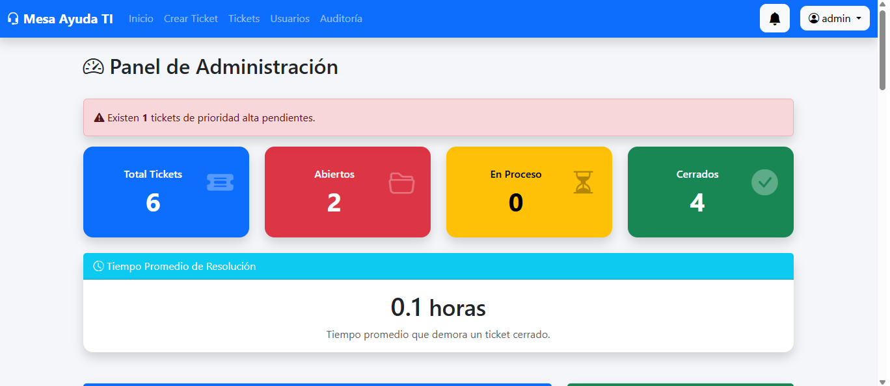
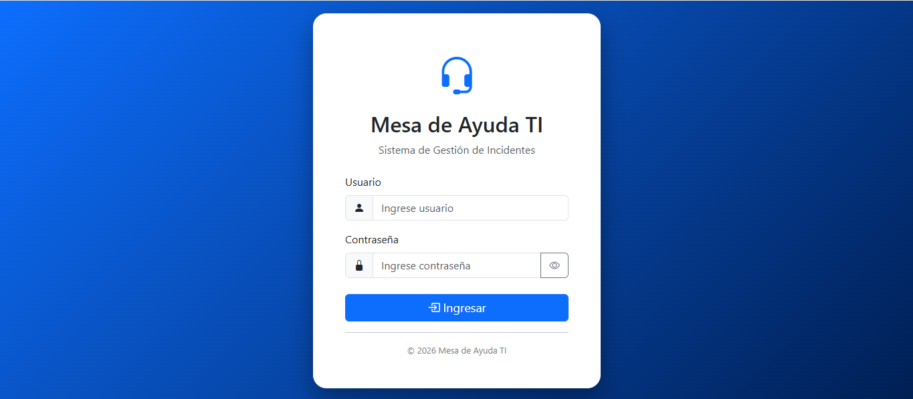
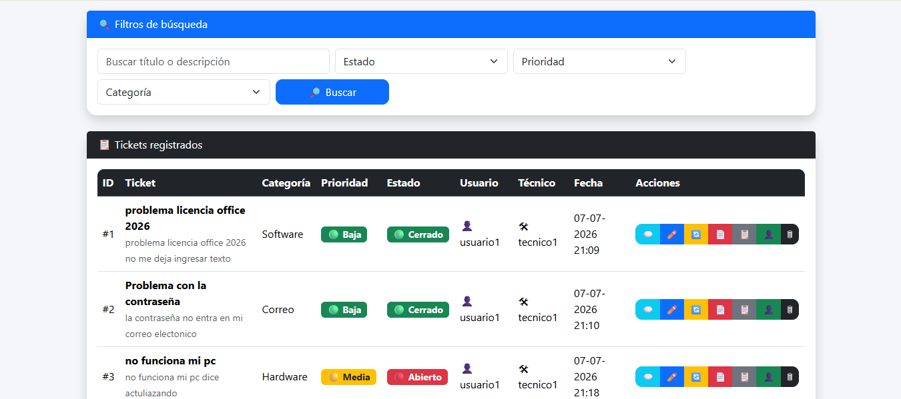
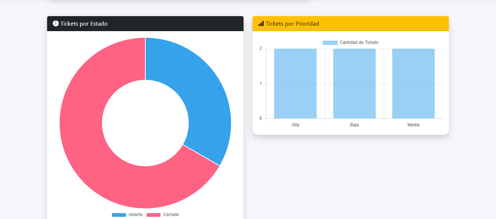

\# MesaAyudaTI




## Capturas del sistema

### Inicio de sesión


### Gestión de tickets


### Estadísticas



Sistema web de Mesa de Ayuda TI desarrollado con Flask.


\## Tecnologías utilizadas


\- Python

\- Flask

\- SQLite

\- Bootstrap 5

\- Chart.js


\## Funcionalidades


\- Gestión de tickets de soporte TI.

\- Inicio de sesión con roles:

&#x20; - Administrador

&#x20; - Técnico

&#x20; - Usuario

\- Creación y seguimiento de tickets.

\- Asignación de técnicos.

\- Historial de atención.

\- Auditoría del sistema.

\- Estadísticas mediante gráficos.


\## Ejecución del proyecto


Instalar dependencias:


```bash

pip install -r requirements.txt


## Módulos del sistema

- 🔐 Autenticación de usuarios
- 👥 Gestión de roles
- 🎫 Creación y seguimiento de tickets
- 👨‍💻 Asignación de técnicos
- 📋 Historial de atención
- 📊 Estadísticas y gráficos
- 🔎 Búsqueda de tickets
- 📝 Auditoría del sistema

## Usuarios de prueba

Ejemplos de perfiles disponibles:

| Usuario | Rol |
|---------|-----|
| admin | Administrador |
| tecnico1 | Técnico |
| usuario1 | Usuario |

## Ejecución del sistema

1. Instalar dependencias:

```bash
pip install -r requirements.txt
